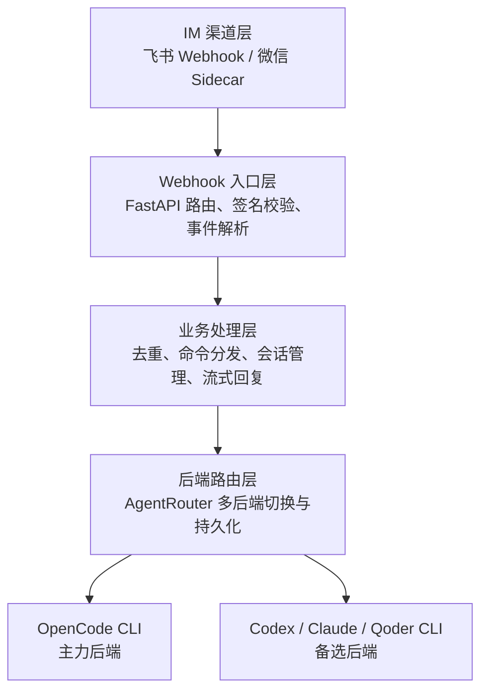
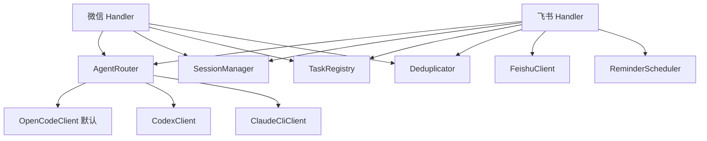

# Architecture

## 技术栈

| 类别 | 技术 | 用途 |
|------|------|------|
| 语言 | Python 3.13+ | 服务主体 |
| 框架 | FastAPI + Uvicorn | Webhook 路由与异步处理 |
| HTTP | httpx | 飞书 OpenAPI 调用 |
| 配置 | pydantic-settings | 环境变量绑定与校验 |
| 加密 | cryptography | 飞书回调解密（AES-CBC） |
| Sidecar | Node.js | 微信 iLink Bot 长轮询 |
| 核心后端 | opencode CLI | AI 推理（默认） |
| 备选后端 | codex / claude / qodercli | 可切换 |

## 架构分层



## 核心模块交互



## 目录结构

```
codeClaw/
├── bin/                        # 服务控制脚本
├── conf/                       # 配置（.env / requirements / pytest）
├── lib/
│   ├── python/
│   │   ├── app/                # FastAPI 入口、配置、命令、日志
│   │   ├── channel/
│   │   │   ├── feishu/         # 飞书渠道全链路
│   │   │   └── wechat/         # 微信渠道
│   │   └── core/
│   │       ├── agent/          # 多后端路由 + opencode_cli + claude_cli
│   │       ├── codex/          # Codex CLI 客户端
│   │       └── session/        # 会话/去重/任务/提醒
│   └── js/
│       └── wechat-sidecar.mjs  # 微信 sidecar
├── tests/                      # 单元测试
└── docs/                       # 项目文档（单层目录，本文件为 architecture.md，索引见 index.md）
```

## 部署

- 单实例 Uvicorn 进程，`./bin/start` 后台启动
- 本机需预装 `opencode` CLI（主力）；`codex` / `claude` / `qodercli` 按需
- 外部依赖：飞书 OpenAPI（HTTP）、微信 iLink Bot API（HTTP 长轮询）
- 持久化：`runtime/server/backend.json`（后端状态）、`runtime/server/reminders.json`（提醒）、`runtime/server/opencode-sessions.json`（opencode 会话 ID）

## 数据流（opencode 默认路径）

```
用户发送消息
  → 飞书 Webhook / 微信 Sidecar 转发
    → FastAPI 路由接收
      → 签名校验 + 去重
        → 命令分发（/help /new /stop /backend 等）
          → AgentRouter.chat_stream()
            → OpenCodeClient: opencode run --session <id> <prompt>
              → 流式读取 stdout
                → 汇总最终答案
                  → 渠道适配（Markdown 卡片 / 分段 / 图片上传）
                    → 回复用户
```
