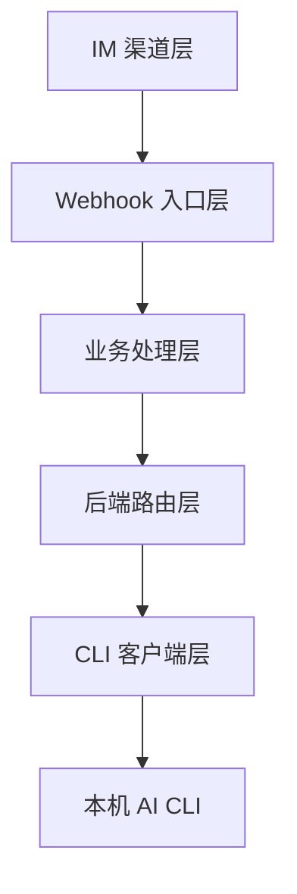
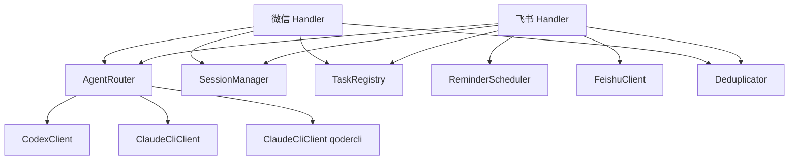

# 系统架构总览

## 项目简介

CodexClaw 是一个单实例 IM → CLI 桥接服务，接收飞书或微信私聊消息，调用本机已安装的 AI CLI 后端（`codex`、`claude`、`qodercli`）处理后回传。核心设计是运行时多后端路由——通过聊天命令即可切换后端，切换状态持久化，重启保留。

## 技术栈

| 类别 | 技术 | 版本 | 用途 |
|------|------|------|------|
| 编程语言 | Python | 3.13+ | 后端服务主体 |
| 后端框架 | FastAPI | - | Webhook 路由与异步处理 |
| ASGI 服务器 | Uvicorn | - | 单实例部署 |
| HTTP 客户端 | httpx | - | 飞书 OpenAPI 调用 |
| 配置管理 | pydantic-settings | - | 环境变量绑定与校验 |
| 加密 | cryptography | - | 飞书回调解密（AES-CBC） |
| JavaScript | Node.js | - | 微信 sidecar 长轮询 |
| CLI 后端 | codex / claude / qodercli | - | AI 推理后端 |

## 项目量级

| 指标 | 数值 |
|------|------|
| 文件总数 | 62 |
| 目录总数 | 28 |
| 代码总行数 | 6813 |

### 按语言统计

| 语言 | 文件数 | 总行数 | 代码行 | 注释行 | 空行 |
|------|--------|--------|--------|--------|------|
| Python | 40 | 6347 | 5364 | 11 | 972 |
| JavaScript | 1 | 466 | 425 | 1 | 40 |

## 架构分层



### 各层职责

- **IM 渠道层**：飞书 Webhook 回调、微信 sidecar 长轮询，负责消息接收与回传
- **Webhook 入口层**：FastAPI 路由、签名校验、事件解析、异步任务分发
- **业务处理层**：去重、命令分发、会话管理、流式回复、图片管线、长任务通知
- **后端路由层**：AgentRouter 多后端切换与持久化，drop-in 替换 CodexClient
- **CLI 客户端层**：CodexClient（codex exec）与 ClaudeCliClient（claude -p），超时/重试/熔断

## 核心模块及交互



### 模块交互说明

- **Handler → AgentRouter**：消息处理时通过 router 调用活跃后端的 `chat`/`chat_stream`
- **AgentRouter → CLI 客户端**：转发请求到活跃后端，`cancel` 广播到所有后端
- **Handler → SessionManager**：读写会话历史，FIFO 裁剪
- **Handler → TaskRegistry**：注册/取消/完成运行中任务
- **Handler → FeishuClient**：回复消息、上传图片、发送 reaction
- **Handler → ReminderScheduler**：登记定时提醒，到期回调发送

## 目录结构

```
CodexClaw/
├── bin/                    # 服务控制脚本
│   ├── server              # start|stop|restart|status|wx|help
│   ├── start               # 快捷入口
│   └── start.sh            # 兼容入口
├── conf/                   # 配置
│   ├── .env.example        # 示例配置
│   ├── pytest.ini          # pytest 配置
│   └── requirements.txt    # 依赖
├── lib/
│   ├── python/
│   │   ├── app/            # FastAPI 入口、配置、命令、日志
│   │   ├── channel/
│   │   │   ├── feishu/     # 飞书渠道（handler/client/models/security/formatting/media）
│   │   │   └── wechat/     # 微信渠道（handler）
│   │   └── core/
│   │       ├── agent/      # 多后端路由（router/claude_cli/types）
│   │       ├── codex/      # Codex CLI 客户端
│   │       └── session/    # 会话/去重/任务/提醒
│   └── js/
│       └── wechat-sidecar.mjs  # 微信 sidecar
├── tests/                  # 单元测试（14 个文件）
├── md/DEVELOPMENT.md       # 开发文档
└── architecture.svg        # 架构图
```

### 关键目录说明

| 目录 | 职责 | 关键文件 |
|------|------|----------|
| `lib/python/app/` | 应用入口与配置 | `main.py`, `config.py`, `commands.py` |
| `lib/python/channel/feishu/` | 飞书渠道全链路 | `handler.py`, `client.py`, `security.py` |
| `lib/python/channel/wechat/` | 微信渠道处理 | `handler.py` |
| `lib/python/core/agent/` | 多后端路由 | `router.py`, `claude_cli.py`, `types.py` |
| `lib/python/core/codex/` | Codex CLI 封装 | `client.py` |
| `lib/python/core/session/` | 会话与任务管理 | `manager.py`, `task_registry.py`, `reminder_scheduler.py` |
| `lib/js/` | 微信 sidecar | `wechat-sidecar.mjs` |

## 部署架构

- **部署方式**：单实例 Uvicorn 进程，`./bin/start` 后台启动
- **运行环境**：本机需预装 `codex` / `claude` / `qodercli` CLI 并完成登录
- **外部依赖**：飞书 OpenAPI（HTTP）、微信 iLink Bot API（HTTP 长轮询）
- **持久化文件**：`runtime/server/backend.json`（后端状态）、`runtime/server/reminders.json`（提醒）
- **运行期文件**：`runtime/codex-workdir/`（CLI 工作目录）、`runtime/feishu-images/`（临时图片）
