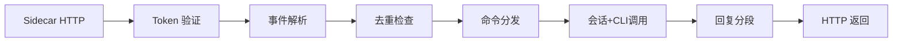

# 微信渠道

## 模块职责

微信私聊消息处理：接收 sidecar 转发的 webhook 请求，解析文本消息，执行命令分发或调用 CLI 后端，同步返回回复列表。

## 关键文件

| 文件 | 职责 | 行数 |
|------|------|------|
| `lib/python/channel/wechat/handler.py` | 微信 webhook 处理流程 | 191 |

## 核心接口/类

### `WeChatWebhookHandler`

- **用途**：微信 webhook 处理器，同步请求-响应模式（区别于飞书的异步后台 task）
- **关键方法**：
  - `handle_webhook(headers, raw_body)` → 验证 token + 解析 + 处理，返回 `{"code": 0, "replies": [...], "context_token": "..."}`
  - `_handle_text_event(event, trace_id)` → 去重、命令分发、CLI 调用、回复分段
  - `_split_reply(text)` → 按 `wechat_message_chunk_chars` 分段

### `WeChatTextMessageEvent`

```python
@dataclass(slots=True)
class WeChatTextMessageEvent:
    message_id: str
    account_id: str
    user_id: str
    text: str
    context_token: str = ""
```

- **用途**：从 sidecar webhook payload 解析的文本消息事件

## 依赖关系

### 上游依赖

- **app.commands**：`process_command`、`build_help_text`、`parse_reminder_command`
- **core.agent.claude_cli**：`ClaudeCliClient._build_skill_summary`（异步 `/skills`）
- **core.agent.types**：`BackendClient` Protocol
- **core.session.***：会话、去重、任务注册
- **channel.feishu.formatting**：`normalize_reply_text`、`split_message_text`

### 下游被依赖

- **app.main**：在 `main.py` 中实例化并注册到 FastAPI 路由

## 数据流



## 注意事项

- 微信渠道为同步请求-响应模式，sidecar 等待 CodexClaw HTTP 返回后才发送回复
- `/remind` 命令被拦截并返回友好提示（微信暂不支持定时提醒）
- 帮助文本通过 `build_help_text(include_remind=False)` 统一生成
- 长任务通知、图片、文件、typing 等功能为后续补充项
- 会话 key 格式为 `wechat:{account_id}:{user_id}`
