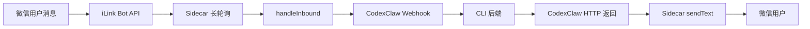

# 服务控制与 Sidecar

## 模块职责

服务启停控制脚本（`bin/server`）与微信 sidecar（`lib/js/wechat-sidecar.mjs`）：前者管理 Uvicorn 进程生命周期，后者负责微信扫码登录、长轮询消息接收与回复发送。

## 关键文件

| 文件 | 职责 | 行数 |
|------|------|------|
| `bin/server` | 服务控制脚本（start/stop/restart/status/wx/help） | 290 |
| `bin/start` | 快捷入口（转发到 server start） | 5 |
| `bin/start.sh` | 兼容入口 | 3 |
| `lib/js/wechat-sidecar.mjs` | 微信 iLink Bot sidecar | 466 |

## 核心接口/类

### `bin/server`

- **用途**：CodexClaw 服务进程管理
- **命令**：
  - `start [-f]` → 启动（默认后台，`-f` 前台）
  - `stop` → 停止
  - `restart` → 重启
  - `status` → 查看状态
  - `wx login` → 微信扫码登录
  - `wx start` → 启动 sidecar
  - `wx stop` → 停止 sidecar
  - `wx status` → sidecar 状态
  - `help` → 帮助
- **首次启动流程**：检查 python3/codex → 创建 .venv → 安装依赖 → 初始化 .env → 引导填写飞书凭证 → 启动 Uvicorn

### `wechat-sidecar.mjs`

- **用途**：微信 iLink Bot 长轮询 sidecar
- **核心函数**：
  - `login()` → 请求二维码 → 轮询扫码状态 → 保存凭证到 `conf/wechat/account.json`
  - `monitor(account)` → 长轮询 `getupdates` → 收到消息调用 `handleInbound`
  - `handleInbound(account, msg)` → 去重 → `postToCodexClaw` → 发送回复
  - `postToCodexClaw(account, msg, text)` → POST 到 CodexClaw webhook → 解析 replies → 逐条发送
  - `startHttpServer(account)` → HTTP 服务（`/healthz` + `/send`）
- **超时**：默认 300000ms（5 分钟），防止 CodexClaw 挂起时永久阻塞
- **contextTokens LRU**：Map 超 1000 条淘汰最早条目，防止无界内存增长

## 依赖关系

### 上游依赖

- **CodexClaw 服务**：sidecar 通过 HTTP webhook 调用 CodexClaw 的 `/webhook/wechat`
- **飞书 OpenAPI**：server 脚本初始化时引导填写飞书凭证

### 外部依赖

- **iLink Bot API**：`https://ilinkai.weixin.qq.com/ilink/bot/*`（长轮询 + 发送消息）
- **Node.js**：sidecar 运行环境
- **Python 3 + uvicorn**：CodexClaw 服务运行环境

## 数据流

## 注意事项

- sidecar 的 `CODEXCLAW_TIMEOUT_MS` 默认 300000ms（5 分钟），可通过环境变量 `CODEXCLAW_WECHAT_TIMEOUT_MS` 调整
- `activeInbound` Set 防止同一消息重复处理，`finally` 块中清理
- `contextTokens` Map 使用简单 LRU 策略（超 1000 条淘汰最早），存储 `accountId:userId → contextToken`
- 微信登录凭证保存到 `conf/wechat/account.json`（已被 `.gitignore` 忽略，权限 0600）
- sidecar 同步等待 CodexClaw HTTP 返回后才发送回复，长任务通知等异步功能暂不支持
