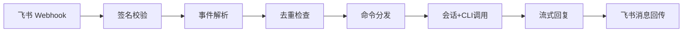

# 飞书渠道

## 模块职责

飞书 Webhook 全链路处理：事件接收、签名校验、消息解析、命令分发、流式回复、图片管线（下载/上传/识别）、长任务通知、定时提醒。

## 关键文件

| 文件 | 职责 | 行数 |
|------|------|------|
| `lib/python/channel/feishu/handler.py` | Webhook 主处理逻辑 | 863 |
| `lib/python/channel/feishu/client.py` | 飞书 OpenAPI 客户端 | 739 |
| `lib/python/channel/feishu/models.py` | 消息事件解析模型 | 228 |
| `lib/python/channel/feishu/security.py` | 签名校验（SHA256）与 AES-CBC 解密 | 86 |
| `lib/python/channel/feishu/formatting.py` | 回复文本规范化、Markdown 卡片、消息分段 | 172 |
| `lib/python/channel/feishu/media.py` | 本地图片路径提取、生成图片目录扫描 | 74 |

## 核心接口/类

### `FeishuWebhookHandler`

- **用途**：飞书 webhook 主处理器，协调去重、命令、会话、流式回复、图片管线
- **关键方法**：
  - `handle_webhook(headers, raw_body)` → 入口，返回 `{"code": 0}`
  - `_handle_text_event(event, trace_id)` → 异步处理消息（后台 task）
  - `_stream_to_feishu(...)` → 流式获取并汇总后单条回复
  - `_safe_reply(...)` → 三级回退（markdown reply → text reply → chat send）
  - `_watch_generated_images(...)` → 后台监控 Codex 生成图片并实时推送

### `FeishuClient`

- **用途**：飞书 OpenAPI HTTP 客户端，token 自动刷新 + 重试
- **关键方法**：
  - `reply_markdown / reply_text / reply_image` → 回复消息
  - `send_markdown / send_text / send_image` → 主动发送
  - `upload_image / download_message_image` → 图片上传/下载
  - `create_reaction` → 快速回执（Typing）
  - `_get_tenant_access_token` → 双检锁 token 刷新
  - `_clear_tenant_access_token` → 401 时清除 token（async + lock）

### `compute_signature`

```python
def compute_signature(timestamp: str, nonce: str, encrypt_key: str, raw_body: bytes) -> str
```

- **用途**：飞书签名计算（`sha256(timestamp + nonce + encrypt_key + body)`）
- **注意**：使用 plain SHA256 而非 HMAC-SHA256，符合飞书官方规范

## 设计模式

| 模式 | 应用位置 | 意图 |
|------|----------|------|
| 策略模式 | `_safe_reply` 三级回退 | markdown → text → chat send 逐级降级 |
| 观察者模式 | `_watch_generated_images` | 后台轮询监控 CLI 生成的图片文件 |
| 模板方法 | `_verify_and_decrypt_payload` | 签名/加密/token 三级验证链 |

## 依赖关系

### 上游依赖

- **app.commands**：命令解析与提醒命令解析
- **core.agent.types**：`BackendClient` Protocol 类型标注
- **core.session.***：会话、去重、任务注册、提醒调度
- **channel.feishu.client**：飞书 OpenAPI 调用
- **channel.feishu.security**：签名校验与解密

### 外部依赖

- **飞书 OpenAPI**：`https://open.feishu.cn/open-apis/*`
- **cryptography**：AES-CBC 解密

## 数据流



## 注意事项

- webhook 在无签名且未加密且未配置 verification_token 时返回 401，防止伪造请求
- 接收的图片在任务完成后自动清理（`_cleanup_downloaded_images`）
- 图片扫描使用 `asyncio.to_thread` 避免阻塞事件循环
- `_looks_like_image_request` 使用原始 `event.text` 判断，避免 `[Feishu images saved locally]` 标记误触发
