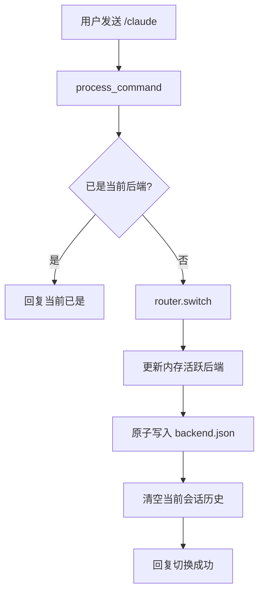

# 多后端路由与切换流程

## 流程概述

用户通过聊天命令 `/codex`、`/claude`、`/qodercli` 切换活跃后端。切换后状态持久化到 `runtime/server/backend.json`，重启保留。切换时清空当前会话历史，避免旧后端的工具/skills/回答风格污染新后端。

## 流程图

## 关键步骤

### 步骤 1：命令解析

- **触发条件**：用户发送 `/codex`、`/claude`、`/qodercli`
- **执行位置**：`lib/python/app/commands.py:84-91`
- **操作内容**：`process_command` 匹配 `BACKEND_COMMANDS` 字典 → 调用 `router.switch(target)`

### 步骤 2：后端切换与持久化

- **执行位置**：`lib/python/core/agent/router.py:79-87`
- **操作内容**：
  - `_normalize(name)` 校验后端名称合法性
  - 更新 `self._active` 内存值
  - `_save_active(name)` 原子写入 `backend.json`（先写 `.tmp` 再 `os.replace`）

### 步骤 3：会话清空

- **执行位置**：`lib/python/app/commands.py:89`
- **操作内容**：`session_manager.reset_session(session_key)` 清空当前会话轮次

### 步骤 4：启动时加载

- **执行位置**：`lib/python/core/agent/router.py:61`
- **操作内容**：`_load_active()` 从 `backend.json` 读取 → 文件不存在则使用 `ACTIVE_BACKEND` 环境变量

## 涉及模块

| 模块 | 角色 | 关键文件 |
|------|------|----------|
| 应用入口与配置 | 命令解析 | `app/commands.py` |
| 多后端路由 | 切换与持久化 | `core/agent/router.py` |
| 会话与任务管理 | 会话清空 | `core/session/manager.py` |

## 异常处理

| 异常场景 | 处理方式 | 相关代码 |
|----------|----------|----------|
| 未知后端名称 | `switch` 返回 False，回复"切换失败" | `commands.py:91` |
| 持久化文件写入失败 | 记录 warning 日志，不影响内存切换 | `router.py:127-128` |
| 持久化文件不存在 | 使用 `ACTIVE_BACKEND` 默认值 | `router.py:61` |

## 性能考量

- 持久化使用原子写（`.tmp` + `os.replace`），避免写入中断导致文件损坏
- 切换是同步操作，无 IO 阻塞（文件写入通常 <1ms）
- `/backend` 命令查询当前后端和可切换列表，不触发切换
