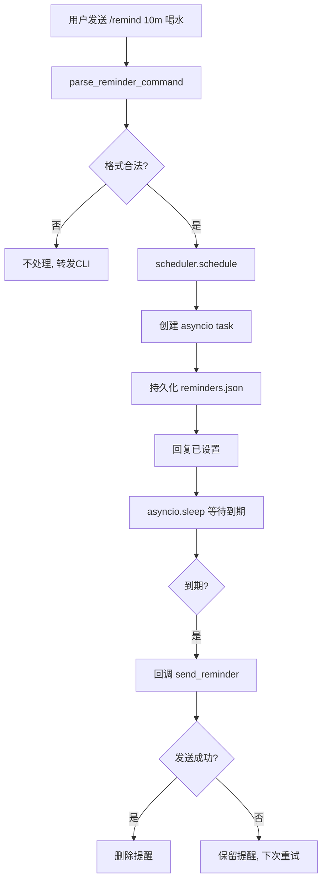

# 定时提醒流程

## 流程概述

飞书用户发送 `/remind 10m 喝水` 命令后，CodexClaw 将提醒登记到单实例 asyncio 调度器并持久化到 JSON 文件。到期后通过飞书 OpenAPI 主动发送提醒消息到 chat_id。失败时不删除提醒，保留以供下次启动重试。

## 流程图

## 关键步骤

### 步骤 1：命令解析

- **触发条件**：用户发送 `/remind <时间> <内容>`（支持 `/timer` 别名）
- **执行位置**：`lib/python/app/commands.py:126-130`
- **操作内容**：正则匹配 `^/(?:remind|timer)\s+(\d+(?:\.\d+)?)([smhdSMHD])\s+(.+)$` → 计算延迟秒数

### 步骤 2：登记与持久化

- **执行位置**：`lib/python/core/session/reminder_scheduler.py:43-58`
- **操作内容**：创建 `Reminder` 对象 → 启动 asyncio task → 持久化到 `reminders.json`（`asyncio.to_thread` + 原子写）

### 步骤 3：等待与触发

- **执行位置**：`reminder_scheduler.py:82-107`
- **操作内容**：`asyncio.sleep(due_at - now)` → 到期后调用回调 `send_reminder(chat_id, text, trace_id)`

### 步骤 4：回调发送

- **执行位置**：`lib/python/app/main.py:32-49`
- **操作内容**：`feishu_client.send_markdown` → 失败则降级 `send_text` → 消息发送到 chat_id

### 步骤 5：启动时恢复

- **执行位置**：`reminder_scheduler.py:36-41`
- **操作内容**：`start()` 从 `reminders.json` 加载未到期提醒 → 重新创建 asyncio task

## 涉及模块

| 模块 | 角色 | 关键文件 |
|------|------|----------|
| 飞书渠道 | 命令触发与回复 | `channel/feishu/handler.py` |
| 应用入口与配置 | 命令解析与回调定义 | `app/commands.py`, `app/main.py` |
| 会话与任务管理 | 提醒调度与持久化 | `core/session/reminder_scheduler.py` |

## 异常处理

| 异常场景 | 处理方式 | 相关代码 |
|----------|----------|----------|
| 回调发送失败 | 不删除提醒，保留在内存和文件中，下次启动重试 | `reminder_scheduler.py:95-100` |
| 持久化文件损坏 | `_load_reminders` 捕获异常，返回空列表 | `reminder_scheduler.py:115-117` |
| 提醒被取消 | `cancel()` 从内存移除并取消 task | `reminder_scheduler.py:60-70` |

## 性能考量

- 持久化使用 `asyncio.to_thread` 执行文件 I/O，避免阻塞事件循环
- 提醒存储在内存 dict 中，查找/删除 O(1)
- 时间单位支持 `s/m/h/d`，最短 1 秒，最长无上限
